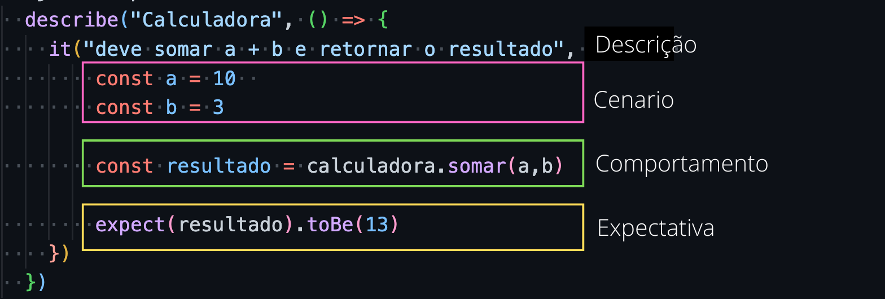

<h1 align="center">
  
</h1>

# Introdução a automação e testes

Turma Online 18 - Todas em Tech  | Back-end | Semana 15 | 2022 | Professora Beatriz Ramerindo


### Instruções
Antes de começar, vamos organizar nosso setup.
* Fork esse repositório 
* Clone o fork na sua máquina (Para isso basta abrir o seu terminal e digitar `git clone url-do-seu-repositorio-forkado`)
* Entre na pasta do seu repositório (Para isso basta abrir o seu terminal e digitar `cd nome-do-seu-repositorio-forkado`)
* [Add outras intrucoes caso necessario]

### Resumo
O que veremos na aula de hoje?
* [Introdução a Testes de Software](#testes-de-software-1)
* [Jest Framework de Testes(Javascript/Typescript)](#jest-e-conceitos-de-teste)

## Conteúdo
### Testes de Software
1. [Teste de Unitário](#testes-unitários-unit-test)
2. [Teste de End To End (Ponta a Ponta)](#testes-de-ponta-a-pontaend-to-end)
### Jest Framework
1. [introdução](#jest-e-conceitos-de-teste)

### Testes de Software

Durante o desenvolvimento de um software precisamos de ferramentas a fim de garantir a qualidade, evolução e manutenção. Como a demanda de software cresce ano a pós ano, surgiu a necessidade de testes automatizados, além dos testes manuais que são feitas com ferramentas como Postman ou Insomia.

O universo é grande e não é responsabilidade somente da QA(Quality Assurance), por exemplo. Existe diversos tipos de testes como desempenho, segurança, funcionalidades... Uma boa desenvolvedora vai se preocupar em escrever testes, isso quando possivel.

Pontos positivos:

 * CI (integração continua) e CD(entrega continua): Permite atráves de uma automação, entrega continua(subir pequenas funcionalidades) e os testes como garantia que está funcionando como deveria.

 * Manutenção: Uma aplicação que possui testes é muito mais facil fazer correções, melhorias ou novas implementaçoes e o processo acontece muito mais rapido

 * Qualidade do código: Escrever testes é uma tarefa dificil e a dificuldade só aumenta se o código estiver mal estruturado. Então é um bom indicador da se o código está bom ou ruim.

 * Documentação viva:  Os testes são uma documentação viva para nós desenvolvedoras, isso porque é possivel saber exatamente como o fluxo da aplicação funciona.29098765467890-0

Pontos negativos:

* Complexidade: desenvolver testes requer muito tempo, porque é necessário definir as regras de negocios e refleti-las no teste, conhecer muito bem a linguagem, framework e o framework de testes.

* Ambiente: Configurar um ambiente para testes é uma tarefa dificil, isso pode variar de acordo com a complexidade do projeto e/ou linguagem e/ou estrura de engenharia da empresa.

* Cultura: Multas empresas ainda hoje, não possui cultura forte de testes. Isso também pode se aplicar a comunidades, por exemplo, a comunidade de Ruby possui forte cultura de testes.

* Constante manutenção: Como a nossa aplicação evolui, é necessário ajustar os testes para que reflita as evoluções das regras de négocio.

#### Testes Unitários (unit test)
Ao fazer testes unitários é possivel criar multiplos cenários e isso permite uma ampla cobertura(coverage), quanto maior a cobertura, maior a seguranca. No entanto, não garante que a API funcione🤡

 * Menos bugs: Como cada unidade(função, metodo, classe) é testada de forma isolada, caso alguem altere e introduza um bug, o teste falha e alerta a desenvolvedora, permitindo que ela faça a correção, antes da feature(funcionalidade) subir para produção.

 * Documentação viva: Caso o teste siga as boas praticas, a desenvolvedora consegue entender com facilidade o que aquela função faz.

 * Refatoração (melhorias): Permite que o código seja refatorado, sem mudar o comportamento.
 
 
 > calculadora.js
 ```javascript
  /**
   * Calculadora
  */

  exports.calculadora = calculadora = {
    somar(a, b) {
      return a+b
    }
  }
 ```

> calculadora.spec.js
```javascript
  describe("Calculadora", () => {
    it("deve somar a + b e retornar o resultado", () => { 
        const a = 10  
        const b = 3

        const resultado = calculadora.somar(a,b)

        expect(resultado).toBe(13)
    })
  })
```

> Explicação



 * `describe()` -> Grupo do que está sendo testado, por exemplo (controller, função, objeto...), dentro dele fica todos os testes.
 
 * `it()` -> A unidade que está sendo testada a descrição do objetivo do teste

 * `Cenario` Geralmente é tudo que é necessário para que o teste seja execultado, nesse exemplo, o método calculadora.`somar`, espera 2 parametros(), que são `a` e `b`.

 * `Comportamento` O que ta sendo testado, nesse caso o método `somar`

 * `Expectativa(expect)` O Resultado esperado do teste, nesse caso, sabemos que `a` possui o valor de `10` e `b` possui o valor de `3`, o resultado final dessa soma será `13` 

#### Testes de Ponta a Ponta(end to end)

Diferentemente dos testes unitários, os testes `end to end` são mais genéricos, isso porque ele possui uma responsabilidade diferente, enquanto o teste unitário vai testar pequenas unidades, ele irá testar tudo funcionando em conjunto. Outro motivo por ele ser mais genérico é que ele leva muito mais tempo para ser execultado e construido.


```javascript
  describe('API', () => {
    test('/GET Colaboradoras', async () => {
       const response = await request(app).get("/colaboradoras/all")

       expect(response.body.length).not.be(0)
    })
  })
```
No caso do teste `end to end`, ele sobe a aplicação e faz chamadas, igual fazemos manualmente, como ele testa todo o fluxo daquele endpoint, ele faz a cobetura de outros pontos, como a conexão com o banco de dados, autenticação, as lógicas envolvendo o banco de dados...


### Jest e conceitos de teste

Jest é um framework de testes para javascript, ele possui uma serie de métodos e recursos que facilita na escrita dos testes. Ao escrever teste é necessário tanto cobrir os cenários feliz e infeliz.

* `Mock` -> informação simulada, geralmente é utilizado para simular uma resposta
* `expect` -> recebe como parametro o resultado de um comportamento
* `toBe` -> recebe como parametro o resultado esperado e sua validação é **estritamente** igual `===`, valida valor e tipo
* `toEqual` -> funciona quase igual o `toBe` a diferenca é que sua validação é mais flexivel `==` valida somente valor
* `not` -> é combinado com outros métodos de validação, para fazer uma negação `expect('moranguinho').not.be('batatinha')`, isso que dizer 'moranguinho' `!==` 'batatinha'
* `toThrows` recebe como parametro um erro, é usado para validar o caminho infeliz.


### Exercícios 
* [Exercicio para sala](https://github.com/mflilian/repo-example/tree/main/exercicios/para-sala)
* [Exercicio para casa](https://github.com/mflilian/repo-example/tree/main/exercicios/para-casa)

### Material da aula 
[slide](https://www.canva.com/design/DAFSUSkC1kc/Li1IUMa4kJWAxil5uOb4gg/view?utm_content=DAFSUSkC1kc&utm_campaign=designshare&utm_medium=link2&utm_source=sharebutton#8)
### Links Úteis
- [https://criainovacao.com.br/surgimento-dos-testes-de-software](https://criainovacao.com.br/surgimento-dos-testes-de-software/)
- [https://www.guru99.com/software-testing-introduction-importance.html](https://www.guru99.com/software-testing-introduction-importance.html)
- [https://www.ibm.com/topics/software-testing](https://www.ibm.com/topics/software-testing)
- [https://www.objective.com.br/insights/automacao-de-testes-um-pouco-da-nossa-historia/](https://www.objective.com.br/insights/automacao-de-testes-um-pouco-da-nossa-historia/)
- [Jest Framework](https://jestjs.io/docs/getting-started)
- [Jest Functions](https://jestjs.io/docs/api)

<p align="center">
Desenvolvido com :purple_heart:  
</p>

